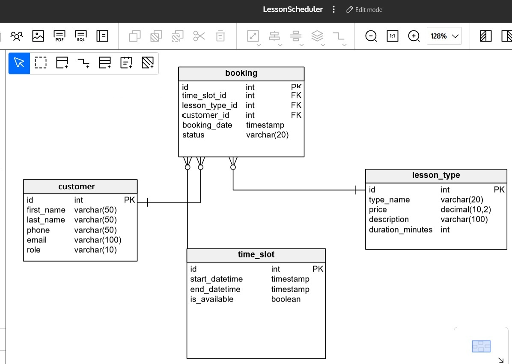

# Lesson Scheduler

A Spring Boot application for managing lesson bookings and scheduling.

### Overview

Lesson Scheduler is a REST API application that allows users to manage bookings for different types of lessons. The system handles time slots, lesson types, customers, and bookings, providing a complete solution for scheduling and managing lessons.

### Features

- **Booking Management**: Create, read, update, and delete bookings
- **Time Slot Management**: Manage available time slots for lessons
- **Lesson Type Management**: Configure different types of lessons with varying durations and prices
- **Customer Management**: Store and manage customer information
- **RESTful API**: Well-documented API with Swagger UI

### Technology Stack

- Java 21
- Spring Boot 3.5.4
- Spring Data JPA
- HSQLDB (in-memory database)
- Lombok
- MapStruct
- Swagger/OpenAPI

### Getting Started

#### Prerequisites

- Java 21 or higher
- Gradle

#### Running the Application

1. Clone the repository:
   ```
   git clone https://github.com/yourusername/lessonScheduler.git
   cd lessonScheduler
   ```

2. Build the application:
   ```
   ./gradlew build
   ```

3. Run the application:
   ```
   ./gradlew bootRun
   ```

   Alternatively, you can run the JAR file directly:
   ```
   java -jar build/libs/lessonScheduler-0.0.1-SNAPSHOT.jar
   ```

4. The application will start on `http://localhost:8080`

#### API Documentation

Once the application is running, you can access the Swagger UI documentation at:
```
http://localhost:8080/swagger-ui.html
```

### Database Configuration

The application uses an in-memory HSQLDB database by default, which is automatically configured and populated with sample data on startup.

If you want to connect to the database using an external tool:
- URL: `jdbc:hsqldb:hsql://localhost:9001/mydb`
- Username: `sa`
- Password: (empty)

### Data Model

The application consists of four main entities:

1. **Booking**: Represents a lesson booking with status tracking
2. **TimeSlot**: Represents available time slots for lessons
3. **LessonType**: Defines different types of lessons with prices and durations
4. **Customer**: Stores customer information



### Sample Data

The application is pre-loaded with sample data including:
- Three lesson types: Arena, Trail, and Basic
- Several time slots
- Three customers
- Four bookings

This sample data allows you to test the application immediately after startup.